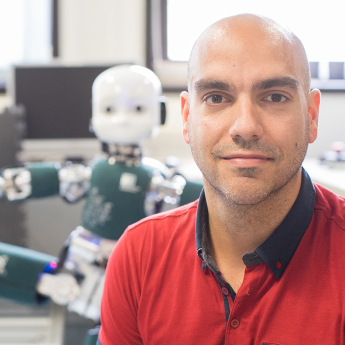
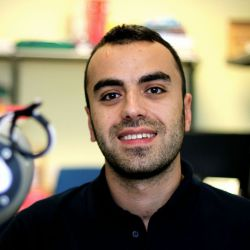
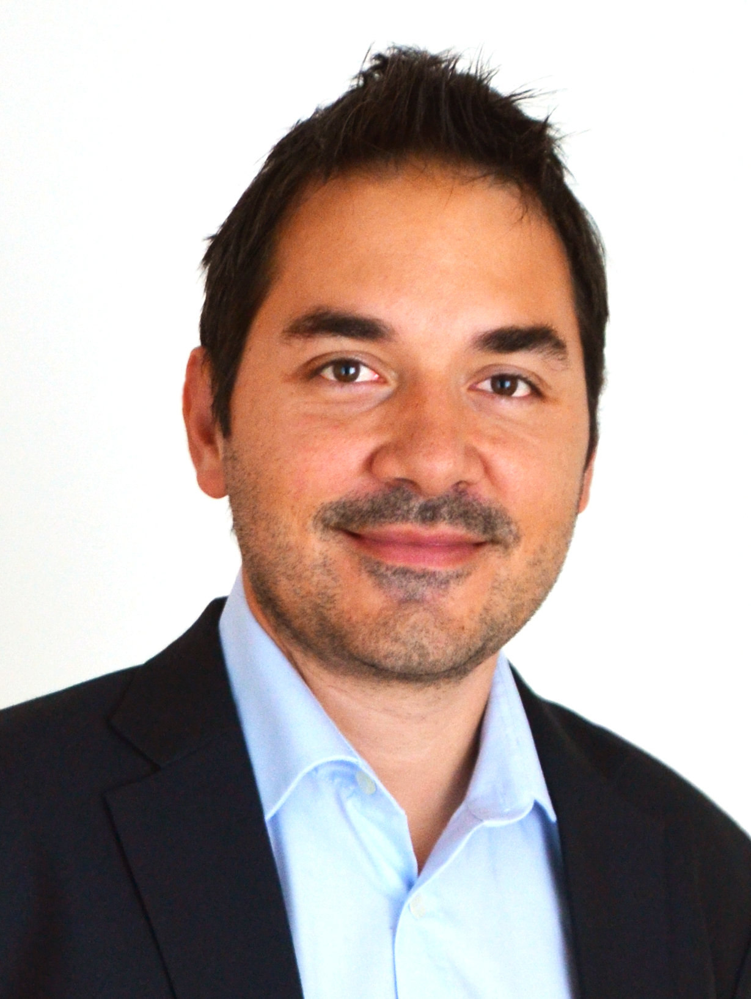
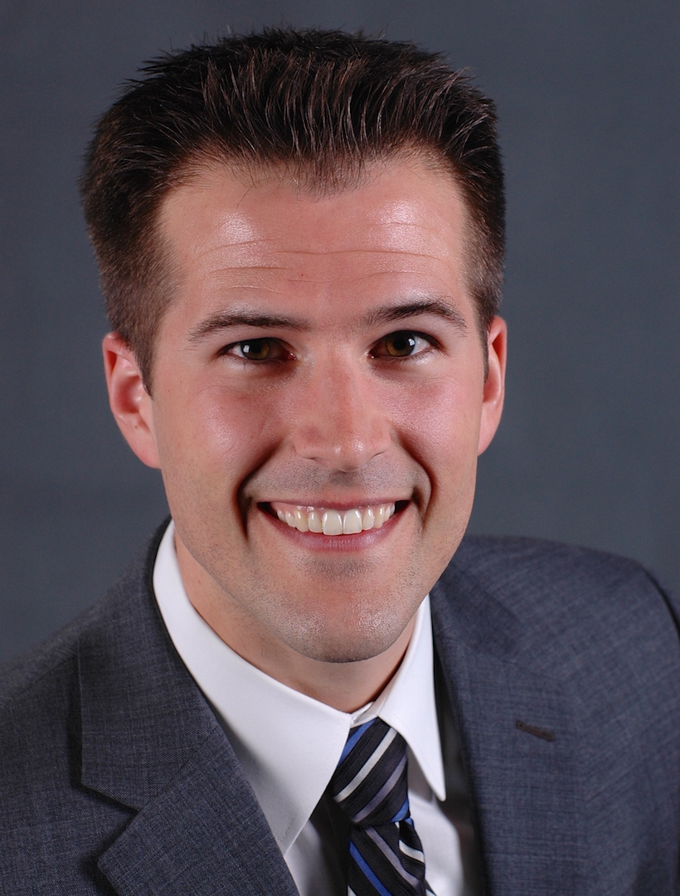
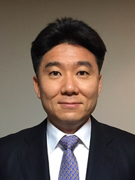

# Full-Day Workshop at 

Starting time: 8.30 AM  - Room to define, if accepted

----
## Outline
[Objectives](#objectives)

[Invited speakers](#invited-speakers)

[Agenda](#agenda)

[Organizers](#organizers): Daniele Pucci, Arash Ajoudani, Matteo Fumagalli, Patrick Wensing, Jaeheung Park

----
## Objectives

This workshop aims to bring humanoid and flying robots closer, both in their theory of control and in the physical platforms themselves, by encouraging discussion between scientists from humanoid and aerial robotics. 

The goal of providing humanoids with capabilities of locomotion and manipulation has driven much recent research in the robotics community. Legged and wheeled locomotion have proven to be feasible on various platforms, supporting a growing envelope of agile ground mobility. Nevertheless, underactuation combined with a large number of degrees-of-freedom commonly challenge the control of locomotion and manipulation in these platforms. With the recent outgrowth of aerial manipulation, these traditionally disparate communities have faced similar challenges.

Thus, this workshop aims to gather scientists towards unifying solutions for challenges in flight, contact locomotion, and manipulation. The envisaged applications belong to the domains of both Whole-Body Loco-Manipulation and Aerial Manipulation.
Historically, control systems for humanoids and flying robots have developed along different paths. Whole-body control of humanoids has addressed high-DoF challenges, but largely has neglected underactuation. Control of aerial vehicles has a strong theoretical underpinning with roots in the control community, providing rigorous methods to address underactuation. Yet, the recent introduction of aerial manipulation has introduced increasingly challenging high-DoF control problems in this domain. 
Thus, there is yet strong potential in bringing humanoid and flying robots closer: both in the theory upon which their control is grounded, and physically in the platforms themselves. A system combining aspects of both platforms may have the capacities of flight, contact locomotion, and manipulation. Such future systems would enlarge the application domain of humanoid and aerial robots, inheriting expanded versatility for future deployment in challenging environments. 

## Invited speakers

|      Name and Surname     |               Institution          |  Talk topic   |       Status      |
| :-----------------------: | :--------------------------------: | :----------:  | :-----------:     |
|         Daniele Pucci     |             IIT                    |  Introductory |     Confirmed     |
|         Russ Tedrake      |             MIT                    |  Locomotion   |     Confirmed     |
|       Olivier Stasse      |      LAAS CNRS                     |  Locomotion   |     Confirmed     |
|       Jaeheung Park       |      Seoul National University     |  Locomotion   |     Confirmed     |
|        Tamim Asfour       |  Karlsruhe Institute of Technology | Manipulation  |     Confirmed     |
|     Abderrahmane Kheddar  |            LIRMM CNRS              | Manipulation  |     Confirmed     |
|     Antonio Bicchi        |               IIT                  | Manipulation  |     Confirmed     |
|     Arash Ajoudani        |               IIT                  | Manipulation  |     Confirmed     |
|     Vincenzo Lippiello    | Università Federico II di Napoli   |      Aerial   |     Confirmed     |
|       Antonio Franchi     |             LASS CNRS              |      Aerial   |     Confirmed     |
|      Koushil Sreenath     |             UC Berkeley            |      Aerial   |     Confirmed     |
|     Matteo Fumagalli      |  Aalborg University of Copenhagen  |      Aerial   |     Confirmed     |
|     Lorenzo Marconi       |        Universita di Bologna       |      Aerial   |     Confirmed     |

<!---
|          Paul Oh          |       University of Nevada         |      Aerial   | Awaiting response |  
|       Lorenzo Marconi     |        Università di Bologna       |      Aerial   | Awaiting response |
|   George Nikolakopoulos   |  Luleå University of Technology    |      Aerial   | Awaiting response | 
|      Matko Orsag          |         University of Zagreb       |      Aerial   | Awaiting response | 
|      Kenji Hashimoto      |     Waseda University              |  Locomotion   | Awaiting response | 
-->
## Agenda
|     Time     |           Speaker         |               Talk title            |       Topic      |
| :-----------:| :-----------------------: | :--------------------------------:  | :---------------:|
| 8:30 -  8:45 |          Organizers       |            Introduction             |  Perspectives    |
| 8:45 -  9:00 |         Daniele Pucci     |  Towards Aerial Humanoid Robotics   |                  |
| 9:00 -  9:30 |       Russ Tedrake        |      LAAS CNRS                      |   Locomotion        |
| 9:30 - 10:00 |     Lorenzo Marconi       |  Extremum seeking control for quick aerial localization of victims buried by avalanches | Aerial |
|10:00 - 10:30 |        Tamim Asfour       |  Generation of Whole-body Loco-Manipulation Actions based on Scene Affordances, Human Motion Data and Natural Language Models |  Manipulation         |
|              |                           |                                    |                |
|10:30 - 11:00 |     Coffee break          |           Coffee break             |  Coffee break  |
|              |                           |                                    |                |
|11:00 - 11:30 | Two contributing presentations |             -                 |         -      |
|11:30 - 12:00 |     Olivier Stasse        |                  -                 |    Locomotion  |
|12:00 - 12:30 |     Antonio Bicchi        |                  -                 |  Manipolazione |
|12:30 - 13:00 |     Vincenzo Lippiello    |                  -                 |      Aerial    |
|              |                           |                                    |                |
|13:0 - 14:00  |     Lunch break           |           Lunch break              |  Lunch break   |
|              |                           |                                    |                |
|14:30 - 15:00 |      Koushil Sreenath     |             UC Berkeley            |           |
|15:00 - 15:30 |     Matteo Fumagalli      |  Aalborg University of Copenhagen  |           |
|15:30 - 16:30 |     Matteo Fumagalli      |  Aalborg University of Copenhagen  |           |
|16:30 - 17:00 |      Koushil Sreenath     |             UC Berkeley            |           |
|17:00 - 17:30 |     Matteo Fumagalli      |  Aalborg University of Copenhagen  |           |
|17:30 - 18:30 |     Matteo Fumagalli      |  Aalborg University of Copenhagen  |           |

## Organizers

### Daniele Pucci

Daniele received the bachelor and master degrees in Control Engineering with highest honors from "Sapienza",  University of Rome, in 2007 and 2009, respectively. In 2013 he received the PhD title in Information and Communication Technologies from University of Nice Sophia Antipolis, France, and in Control Engineering from “Sapienza” University of Rome, Italy. Since then, Daniele has been a post-doctoral fellow at the Italian Institute of Technology at the Dynamic Interaction Control laboratory. Within the CoDyCo project (FP7-ICT-2011.2.1, number: 600716), he has been the principal scientific contributor and he has developed innovative control techniques for whole-body motion control with tactile and force/torque sensing. Daniele's research interests include control of nonlinear systems and its applications to aerial vehicles and robotics.

### Arash Ajoudani

Arash Ajoudani received his PhD degree in Robotics and Automation from Centro "E Piaggio", University of Pisa, and Advanced Robotics Department (ADVR), Italian Institute of Technology (IIT), Italy (14 July 2014). His PhD thesis was a finalist for the Georges Giralt PhD award 2015 - best European PhD thesis award in robotics. He is currently a tenure-track scientist and the leader of the Human-Robot Interfaces and physical Interaction (HRI2) lab of the IIT. He was a finalist for the best manipulation paper award at ICRA 2012, a winner of the best student paper award at ROBIO 2013, a finalist for the best oral presentation award at Automatica (SIDRA) 2014, and a finalist for the best interactive paper award at Humanoids 2016. He is the author of the book "Transferring Human Impedance Regulation Skills to Robots" and several publications in journals, international conferences, and book chapters.  He is currently serving as the executive manager of the IEEE-RAS Young Reviewers' Program (YRP), chair and representative of the IEEE-RAS Young Professionals Committee, and co-chair of the IEEE-RAS Member Services Committee. He has been serving as a member of scientific advisory committee and as an associate editor for several international journals and conferences such as IEEE RAL, Biorob, ICORR, etc. His main research interests are in physical human-robot interaction and cooperation, robotic manipulation, robust and adaptive control, rehabilitation robotics, and tele-robotics.

### Matteo Fumagalli 

Matteo Fumagalli is Assistant Professor in Mechatronics within the Department of Materials and Production at Aalborg University. He received my M.Sc. in 2006 from Politecnico di Milano, and the PhD degree from the University of Genoa, after a 4 years collaboration with the IIT – Istituto Italiano di Tecnologia. He was post-doc at the Robotics and Mechatronics group of the University of Twente, where he carried out research on mechatronic design of advanced robotic systems, including aerial manipulators and compliant mechanisms for robotics. His research interests are in the study and control of the interaction between mechanical systems, and design of robotic mechanisms (such as aerial manipulators) and sensors to control and accomplish safe physical interaction tasks. He have been involved in several EU projects, including CHRIS, AIROBOTS, SHERPA. Moreover, during the last period at the University of Twente, he was the PI for the H2020 project AEROWORKS.

### Patrick Wensing

Patrick Wensing is an Assistant Professor in the Department of
Aerospace and Mechanical Engineering at the University of Notre
Dame. He received his Ph.D. in Electrical and Computer Engineering
from The Ohio State University in 2014, and completed Postdoctoral
training at MIT in 2017. He was awarded an NSF Graduate Research
Fellowship for his dissertation research on balance control strategies
for humanoid robots. At MIT, the results of his postdoctoral work on
the MIT Cheetah robot have received considerable publicity
worldwide, with features from TIME, WIRED, and the Wall Street
Journal.

### Jaeheung Park

Jaeheung Park received the B.S. and M.S. degrees in Aerospace Engineering from Seoul National University, Korea, in 1995 and 1999, respectively, and the Ph.D. degree in Aeronautics and Astronautics from Stanford University, U.S. in 2006. From 2006 to 2009, He was a Post-doctoral researcher and later a Research Associate at Stanford Artificial Intelligence Laboratory. From 2007 to 2008, he worked part-time at Hansen Medical Inc., a medical robotics company in U.S. Since 2009, he has been a professor (now associate professor) in the department of Intelligent Convergence Systems at Seoul National University, Korea. His research interests lie in the areas of robot-environment interaction, contact force control, robust haptic teleoperation, multicontact control, whole-body dynamic control, biomechanics, and medical robotics.
